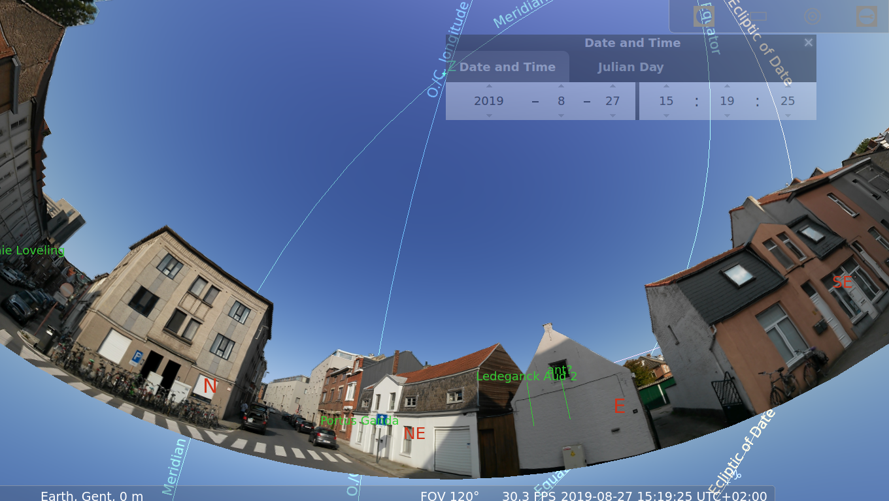
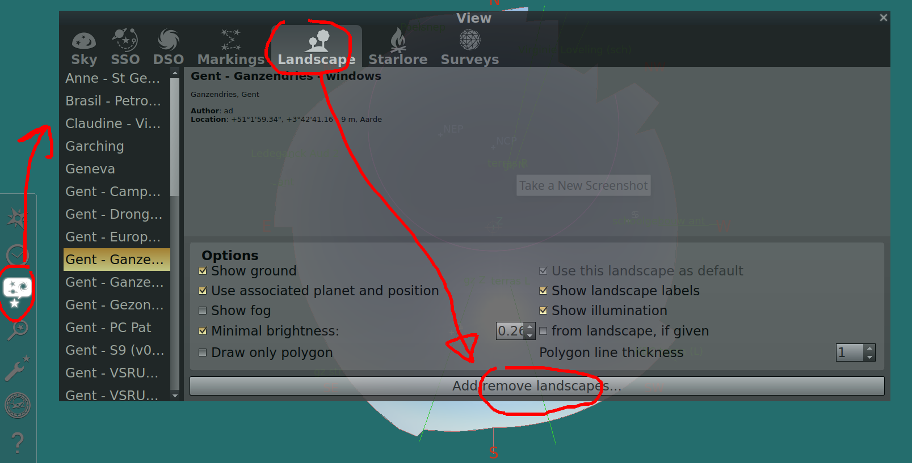
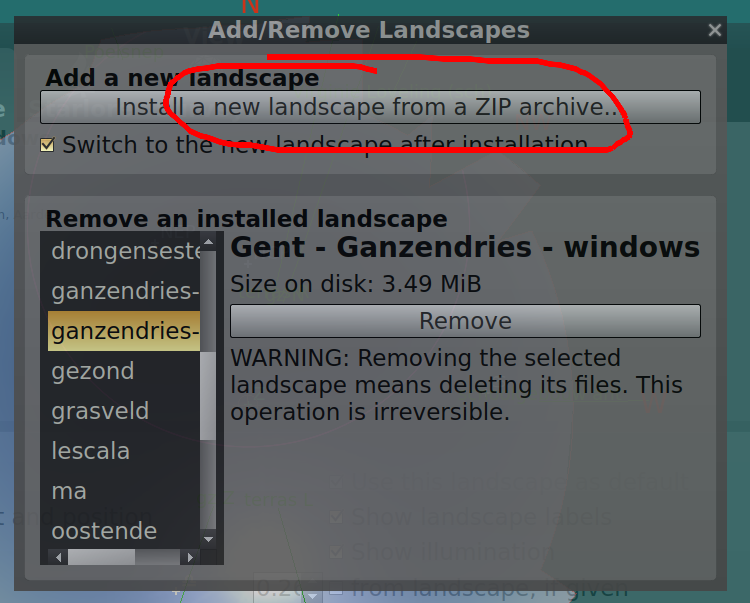
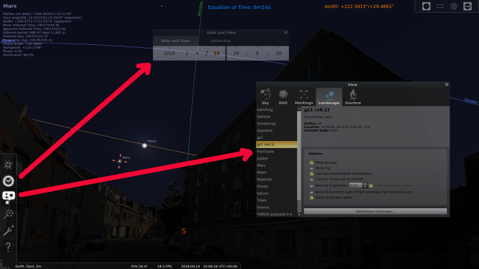

Landscape file for use in `Stellarium <https://stellarium.org/>`_.

.. figure:: stellarium-062.png

    Ganzendries looking S/SW, 2019-08-27 1519+02

    Ganzendries looking NE, 2019-08-27 1519+02

Installing a landscape
===

Save the zip file from https://github.com/axd1967/sl-l-gz1/releases

Open the landscape manager

Import the zip file

Enable the landscape
===

